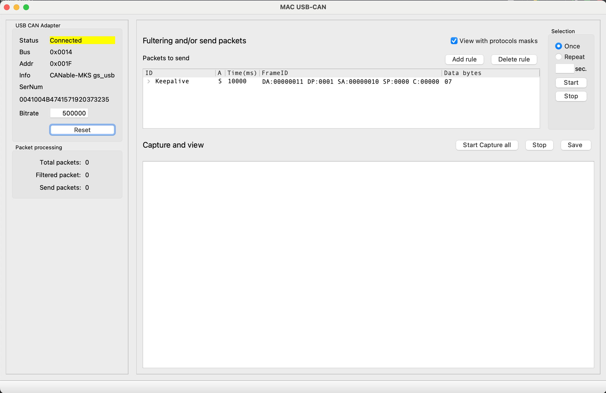

# SMHomeCAN-USB

The SMHomeCAN is a frontend GUI for MKS CANable USB adapter.
It uses as simple GUI for lookup can network, so the main purpose is to quick look 
and diagnostic the CAN network for MACOS.
With time, it grows with function to split can packets ID to slices and display 
slices as separate number even if slices are not bit aligned.
This feature is useful when we add some logic in can frame ID some logic in own can 
protocol implementation with microcontroller.
Of course, it is still useful for dumping any other CAN network.



SMHomeCAN provides the following function: 
 - Capture CAN packets
 - send can packet
 - Highlighting market packet 
 - Use capture filters
 - Make small subsequence of send and wait for receive or wait and then sent etc
 - Diaplay filter ond/or packets with protocol mask


## Define filters snd subsequence


## Define protocol mask


## Platform
Thi app is tested on MacOS 12 with Python 3.11 for MKS CANable pro (gs_usb firmware) adapter.
Uses PYQT5 and SG_USB CAN adapter driver
Because it is written on python, it can run on other platform (Win And Unix)

## Required
```commandline
gs-usb                    0.3.0
packaging                 23.1
pyinstaller               5.13.0
PyQt5                     5.15.9
PyQt5-Qt5                 5.15.2
PyQt5-sip                 12.12.1
pyusb                     1.2.1
PyYAML                    6.0.1
```
All requirements can be installed with PIP in venv environment

## Install
```commandline
/bin/bash ./build.sh
```
The build version will place in
```commandline
dist/SMHomeCAN-USB
```

## RUN
Wor run from source code in the current directory:
```
source venv/bin/activate
python main.py
```

##  About
Author: Artem Belyaev - artem.belyaev@gmail.com
Licanse: MIT

